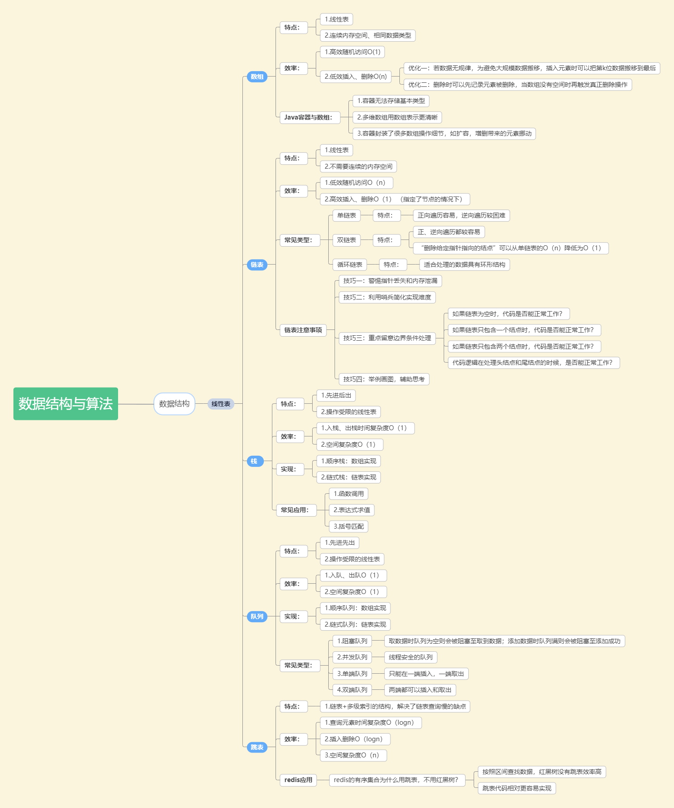
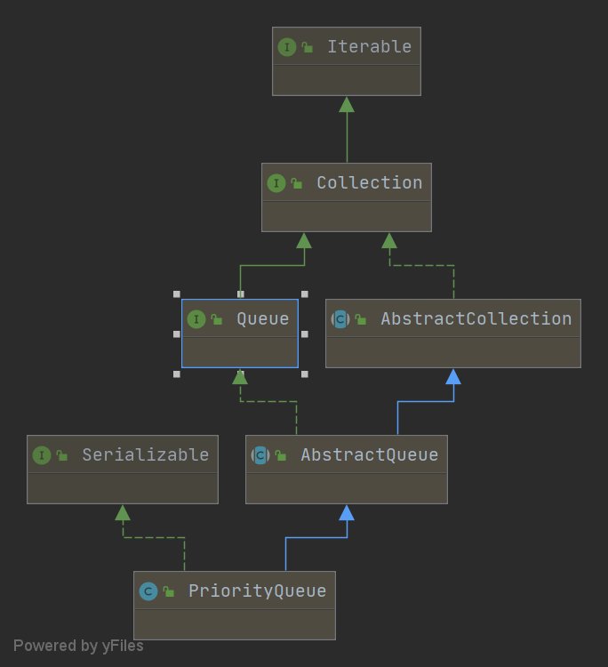

### 本周数据结构要点总结


### Queue源码分析
Java中Queue是个接口，其提供了如下几个重要API：
##### 向队列添加元素

* boolean add(E e);

* boolean offer(E e);
向队列中添加一个元素，区别在于当队列满时，add会抛出IllegalStateException异常，而offer不会
#####  从队列中删除元素
* E remove();
* E poll();
从队列中删除一个元素，区别在于当队列为空时，remove会抛出NoSuchElementException异常，而poll不会
##### 查询队首元素
* E element();
* E peek();
查询队首的元素，和删除的区别在于只是取出，并不真正删除。那element和peek的区别在于当队列为空时候element会抛出NoSuchElementException异常，而peek不会

队列特性的API就以上3类，从队列满和空时是否抛出异常角度来分类的话add、remove、element是一类，会抛出异常；offer、poll、peek是一类，不会抛出异常，需要通过返回值判断


### PriorityQueue源码分析
#### 1. 整体架构
PriorityQueue从名字上即可理解，它是一个优先级队列，特点就是取元素的时候按照优先级来取
##### 1.1 类图
先看下其继承结构

Queue是基础接口，所有队列基本上都会实现它。
AbstractQueue->AbstractCollection->Collection->Iterable 这条继承路径主要是想复用Collection和迭代器的一些操作
除此以外并没有什么特殊的地方了。
##### 1.2 类注释
从类注释当中我们可以获得以下信息：

1. 无界（unbounded）
2. 使用优先级堆实现（based on a priority heap），同时是个小根堆
3. 不允许null元素（does not permit null elements）
4. 默认按自然排序，除非提供了排序器；不支持不能排序的元素
5. 能够自动扩容
6. 非线程安全（is not synchronized）
7. 入队、出队操作O(log(n))时间复杂度；查询队首元素O（1）时间复杂度

##### 1.3 内部组成
```
//默认数组初始化大小
private static final int DEFAULT_INITIAL_CAPACITY = 11;

//内部采用数组来实现二叉堆
transient Object[] queue; // non-private to simplify nested class access

//优先队列中的元素数量，即queue数组内的元素数量
private int size = 0;

//自定义比较器，如果没提供则为null
private final Comparator<? super E> comparator;

//队列被修改次数，
transient int modCount = 0;

```
Java中的优先级队列实际上是使用二叉堆来实现，是个小根堆，也就是说堆定元素是队列中最小的元素。

#### 2. 主要API实现
##### 2.1 初始化
提供了众多构造函数，大致如下几类：
1. 默认
2. 提供了初始化容量或提供了比较器或初始容量和比较器都提供了
3. 提供其他一个集合来构建，支持：Collection、PriorityQueue、SortedSet
其中PriorityQueue、SortedSet本身即排序的，所以新的PriorityQueue会沿用他们的比较器。而Collection的话会用默认的比较器
```
//默认构造函数，使用默认容量和默认的比较器
public PriorityQueue() ；

//提供了初始容量的构造方法
public PriorityQueue(int initialCapacity) ；

//提供了自定义比较器的构造方法
public PriorityQueue(Comparator<? super E> comparator) ；

//提供了初始容量及自定义比较器的构造方法
public PriorityQueue(int initialCapacity,  Comparator<? super E> comparator) ；

//通过 collection构建
public PriorityQueue(Collection<? extends E> c)；

//通过另一个优先级队列构建
public PriorityQueue(PriorityQueue<? extends E> c) ；

//通过排序集合构建
public PriorityQueue(SortedSet<? extends E> c) ；
```

##### 2.2 add() && offer()
此处的add是通过offer来实现的，故只要分析offer即可
逻辑比较简单，大致如下：
1. 不支持null元素
2. 容量不够要扩容
3. 第一个元素直接简单处理
4. 非第一个元素则要走堆的插入算法

```
public boolean offer(E e) {
    //不支持null元素
    if (e == null)
        throw new NullPointerException();
    modCount++;
    int i = size;
    //如果目前元素数量已经达到或超过数组大小，就要进行扩容
    if (i >= queue.length)
        grow(i + 1);
    size = i + 1;
    //第一个元素只要直接放数组第一个节点即可
    if (i == 0)
        queue[0] = e;
    else
        //其他情况需要使用堆的插入算法
        siftUp(i, e);
    return true;
}
```
先看扩容，大致逻辑如下：
1. 如果数组还比较小（<64），大胆扩容，一次扩大一倍；如果数组比较大了（>=64），谨慎扩容，一次扩大50%
2. 新容量可能存在溢出情况，需要进行处理
3. 将原数组拷贝到新数组中
```
private void grow(int minCapacity) {
    int oldCapacity = queue.length;
    // Double size if small; else grow by 50%
    // 原始容量小于64则一次扩容一倍；否则扩容50%
    int newCapacity = oldCapacity + ((oldCapacity < 64) ?
                                     (oldCapacity + 2) :
                                     (oldCapacity >> 1));
    // overflow-conscious code
    //新容量溢出处理
    if (newCapacity - MAX_ARRAY_SIZE > 0)
        newCapacity = hugeCapacity(minCapacity);
    //拷贝原数组到新的数组
    queue = Arrays.copyOf(queue, newCapacity);
}

//新容量大于默认最大值则使用int最大值作为新容量，否则使用默认的最大值
private static int hugeCapacity(int minCapacity) {
    if (minCapacity < 0) // overflow
        throw new OutOfMemoryError();
    return (minCapacity > MAX_ARRAY_SIZE) ?
        Integer.MAX_VALUE :
        MAX_ARRAY_SIZE;
}
```
再看siftUp，根据是否提供了比较器，走不同的方法，大同小异，看提供了比较器的siftUpUsingComparator

往堆中插入一个元素叫堆化（heapify），有从下往上和从上往下两种方法。Java的实现是从下往上，大致过程如下：
新节点放最后，依次跟父节点比较大小，如果比父节点小（小根堆），那么和父节点交换

图片来源：https://www.jianshu.com/p/21bef3fc3030


此处堆是采用数组存储的，有一个特点就是索引为n的节点：
左子节点存储在：2n + 1 索引下
右子节点存储在：2n + 2 索引下
同时索引为n的节点，他的父节点索引是：
（n-1）/2


```
private void siftUpUsingComparator(int k, E x) {
    while (k > 0) {
        //找到父节点索引
        int parent = (k - 1) >>> 1;
        //取出父元素和待插入元素比较：
        1.如果待插入元素更大，则放在最后
        2.如果待插入元素小，则将和父元素交换
        Object e = queue[parent];
        if (comparator.compare(x, (E) e) >= 0)
            break;
        queue[k] = e;
        k = parent;
    }
    queue[k] = x;
}
```

##### 2.2 poll() && remove()
同样，remove调用的是poll，直接看poll即可。
poll采用的就是堆的删除算法-从上往下堆化：
1.堆顶元素即结果
2.将最后一个元素来替换堆顶
3.然后堆顶元素和其子节点进行比较、交换，一直如此处理下去，直到叶子节点或者不需要交换
图片来源：https://www.jianshu.com/p/21bef3fc3030

```
public E poll() {
    if (size == 0)
        return null;
    int s = --size;
    modCount++;
    E result = (E) queue[0];
    E x = (E) queue[s];
    queue[s] = null;
    if (s != 0)
        siftDown(0, x);
    return result;
}
```
```
private void siftDownUsingComparator(int k, E x) {
    int half = size >>> 1;
    while (k < half) {
        int child = (k << 1) + 1;
        Object c = queue[child];
        int right = child + 1;
        if (right < size &&
            comparator.compare((E) c, (E) queue[right]) > 0)
            c = queue[child = right];
        if (comparator.compare(x, (E) c) <= 0)
            break;
        queue[k] = c;
        k = child;
    }
    queue[k] = x;
}
```

##### 2.3 其他API
remove(Object o)
删除指定的元素，通过遍历数组来实现，只会删除满足条件的第一个

boolean removeEq(Object o) 
删除指定元素，与上一个API不同的是，上面用的是equal，这个是判断是否同一引用

public void clear()
清空优先级队列，遍历置null

#### 3. 总结
优先级队列的特点就是出队的顺序并不是先进先出，而是按优先级出队，应用在特殊的工程场景下。
有很多种实现方式，其中Java的实现是通过二叉堆来实现，而堆又是通过数组来存储。
入队的操作是自下而上，通过重复交换过程实现，每次交换上一个层级，所以平均时间复杂度和树高相同，为O(log(n))
出队的操作本身很快，因为直接拿堆顶元素即可，但是需要再次堆化，堆化是自上而下，也是通过重复交换过程实现，时间复杂度也为O(log(n)

时间有限，以上分析仓促完成，如有错误和纰漏，还望指正


